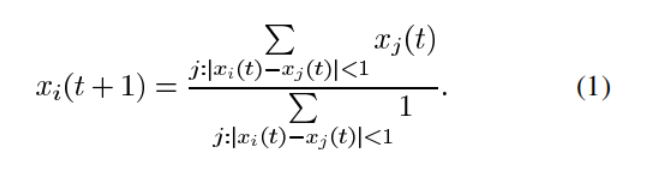
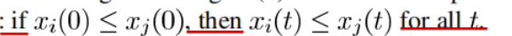
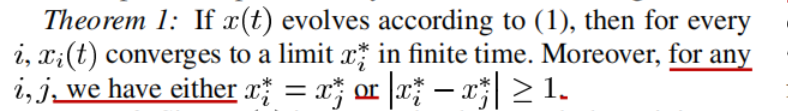
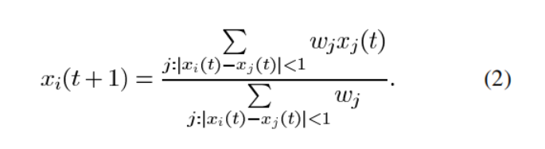
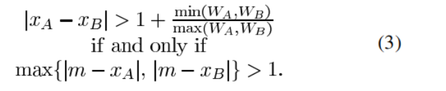
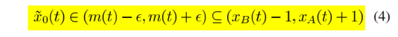

# VD Blondel_StateDependentMAS_2009

> 标题：On Krause’s Multi-Agent Consensus Model
> With State-Dependent Connectivity
> 作者：Vincent D. Blondel, Julien M. Hendrickx, and John N. Tsitsiklis
> 机构：IEEE
> 引用：

## 研究问题 Research Question

### 科学问题 Science Question

设计一种多智能体共识模型，使得智能体之间的状态能够收敛到一致，并且考虑智能体之间的动态连接状态，不断更新智能体的状态，该论文主要是探究如何在平衡稳定性下找到簇团间距的界限

### 研究核心 Core of the research

* 相邻两个簇团之间的距离与智能体个数、智能体初始分布情况(离散或连续)、智能体初始立场局限的长度的关系
* 相邻两个簇团之间的距离对于收敛情况的影响

* 新加入的智能体的状态和权重对新的收敛情况的影响
* 如何建立多智能体稳定的平衡的的收敛

### 研究意义 Research significance

提高多智能体形成共识模型下收敛的平衡稳定性

### 现有方法的不足 Shortcomings of existing algorithm

* 对于得出相邻簇团距离为2.2的结论不可用，尚不清楚连续的簇团间距是否具有某种规律性或收敛性的性质

### 结论 Conclusion

* 不能保证系统1

  

  会收敛到一个稳定的平衡值

* 对于一群给定的平滑分布的初始状态，随着智能体个数的增加，几乎总能获得一个稳定的平衡收敛

* 如果L满足`L - 11/12 +O(1/n) < L/2 +1`那么只有一个簇团，这比图示2得出的5.1还要小

---

## 理论与方法 Theory and Method

1. 智能体的更新受到与他相邻一定距离的智能体的影响，且更新后的状态如下

   

   

2. 基本性质：如果一个智能体的初始状态小于另一个智能体的初始状态，则任意时刻下前者的状态将一直小于后者

   

   

3. 对于任意两个下标不同的智能体，他们在有限的时间内收敛到的极限值，要么相同，要么两者之差大于等于1

4. 相较于(1)对x_j(t)的的取量有了改变，增加的权重的判断

   

5. 当两个簇团的权重相同时，那么他们的最终的间距大于等于2；当他们的权重不相同时，他们的间距严格地大于`1+min(W_A,W_B)/max(W_A+W_B)`

6. 某时刻下的新加的智能体的状态总在如图范围内

   

---

## 实验 Experiment

1. **图示2**

   在定理1中提到：对于任意两个下标不同的智能体，他们在有限的时间内收敛到的极限值，要么相同，要么两者之差大于等于1。

   而在研究簇团个数和簇团位置与智能体初始状态所局限的一段长度的关系时，发现在长度约为5.1时才出现了多个簇团，与定理1中该长度至少为1会出现多个簇团这个说法仍有一定的差距。

   

2. **图示3**

   智能体初始状态均匀分布在[0,+∞]之间时，发现每一个智能体与有限个智能体建立联系、与其余智能体断开联系，且每两个相邻的簇团之间的距离接近于2.2，这在一定程度上解释了在图示2中簇团个数的进化(即为何在L=5.1时才出现两个簇团)

   

3. **图示4**

   在智能体为“亚稳定”状态下，两个簇团之间不会建立联系，但是会受到两个簇团之间的一部分智能体的影响；

   根据两个簇团间的距离，有时即使存在一些新增的智能体，该平衡也是稳定的，有时却不稳定

   

4. **图示5**

   引入了**x**(向量)作为智能体在平衡状态下的度量值，从新加入的智能体本身的性质(权重和初始状态)和原系统连两个收敛簇团的权重`WA和WB`和位置`x_A和x_B`两个大方面分析了新加其在加入原系统后得到的新的收敛对原系统收敛的影响程度。

---

## 总结与思考 Summary and Reflections

这篇论文的`DISCRETE-AGENT MODEL`从基础性质和收敛、实验观察、关于新增智能体对稳定性的影响三方面展开，讲述了智能体、簇团、收敛等多个变量的联系，通过实验探求建立多智能体平衡稳定性下多个变量值的设定，尽可能提高收敛的稳定性，同时也分析了新增智能体对原始系统的影响。

​																																				                    ----------陈羽彤